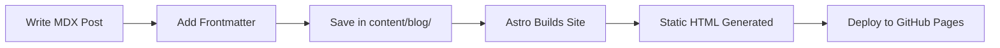
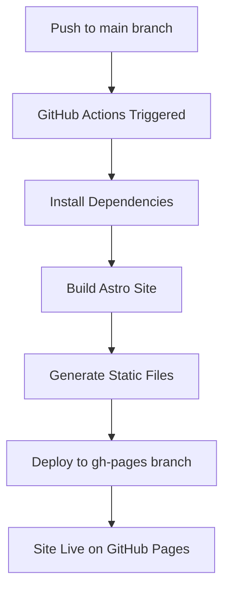

# Personal Developer Portfolio & Blog - Architecture Plan

## Recommended Stack: Astro

### Why Astro?
1. **Performance First**: Ships zero JavaScript by default, only hydrates interactive components
2. **Developer Friendly**: 
   - Built-in TypeScript support
   - Hot module replacement
   - Component-based architecture
   - Can use React components when needed
3. **Content Focused**: 
   - Native MDX support for blog posts
   - Content collections for type-safe content management
   - Markdown frontmatter for metadata
4. **GitHub Pages Compatible**: 
   - Static site generation
   - Easy deployment with GitHub Actions
   - Custom domain support

### Tech Stack Details

```
Core Framework: Astro 4.x
Language: TypeScript
Styling: Tailwind CSS (utility-first, highly customizable)
Content: MDX (Markdown + JSX components)
Deployment: GitHub Pages via GitHub Actions
Optional: React components for interactive features
```

## Project Structure

```
blogfolio/
├── src/
│   ├── components/          # Reusable UI components
│   │   ├── Header.astro
│   │   ├── Footer.astro
│   │   ├── Navigation.astro
│   │   ├── BlogCard.astro
│   │   ├── ProjectCard.astro
│   │   └── ThemeToggle.tsx  # React component for interactivity
│   ├── layouts/             # Page layouts
│   │   ├── BaseLayout.astro
│   │   ├── BlogPost.astro
│   │   └── ProjectLayout.astro
│   ├── pages/               # Routes (file-based routing)
│   │   ├── index.astro      # Homepage/Portfolio
│   │   ├── blog/
│   │   │   ├── index.astro  # Blog listing
│   │   │   └── [...slug].astro  # Dynamic blog posts
│   │   ├── projects/
│   │   │   └── index.astro  # Projects showcase
│   │   └── about.astro
│   ├── content/             # Content collections
│   │   ├── blog/            # Blog posts (MDX files)
│   │   │   ├── post-1.mdx
│   │   │   └── post-2.mdx
│   │   └── config.ts        # Content schema definitions
│   ├── styles/
│   │   └── global.css       # Global styles
│   └── utils/               # Utility functions
│       └── formatDate.ts
├── public/                  # Static assets
│   ├── images/
│   ├── favicon.svg
│   └── robots.txt
├── .github/
│   └── workflows/
│       └── deploy.yml       # GitHub Pages deployment
├── astro.config.mjs         # Astro configuration
├── tailwind.config.mjs      # Tailwind configuration
├── tsconfig.json            # TypeScript configuration
└── package.json
```

## Key Features

### 1. Homepage/Portfolio
- Hero section with introduction
- Featured projects showcase
- Skills/technologies section
- Recent blog posts preview
- Contact/social links

### 2. Blog System
- MDX support for rich content
- Syntax highlighting for code blocks
- Reading time estimation
- Tags/categories
- RSS feed
- SEO-optimized metadata

### 3. Projects Showcase
- Project cards with descriptions
- Tech stack badges
- Live demo and GitHub links
- Filterable by technology

### 4. Developer Experience
- TypeScript for type safety
- Hot reload during development
- Component-based architecture
- Markdown-based content (easy to write)
- Git-based workflow

### 5. Performance & SEO
- Static site generation (fast loading)
- Optimized images
- Minimal JavaScript
- Meta tags and Open Graph
- Sitemap generation
- Lighthouse score 90+

## Content Management Flow



## Deployment Workflow



## Styling Approach

### Tailwind CSS Benefits
- Utility-first approach (fast development)
- Responsive design built-in
- Dark mode support
- Customizable design system
- Small bundle size (purges unused CSS)

### Design Principles
- Clean, minimal aesthetic
- Focus on readability
- Mobile-first responsive design
- Accessible (WCAG 2.1 AA)
- Fast loading times

## Content Schema Example

```typescript
// src/content/config.ts
import { defineCollection, z } from 'astro:content';

const blog = defineCollection({
  schema: z.object({
    title: z.string(),
    description: z.string(),
    pubDate: z.date(),
    author: z.string().default('Your Name'),
    tags: z.array(z.string()),
    image: z.string().optional(),
    draft: z.boolean().default(false),
  }),
});

export const collections = { blog };
```

## GitHub Pages Configuration

### Custom Domain (Optional)
- Add CNAME file to public/
- Configure DNS settings
- Enable HTTPS

### Base URL Configuration
```javascript
// astro.config.mjs
export default defineConfig({
  site: 'https://yourusername.github.io',
  base: '/blogfolio', // if using project pages
});
```

## Development Commands

```bash
npm run dev          # Start dev server
npm run build        # Build for production
npm run preview      # Preview production build
npm run astro add    # Add integrations
```

## Recommended Integrations

1. **@astrojs/mdx** - MDX support
2. **@astrojs/tailwind** - Tailwind CSS
3. **@astrojs/sitemap** - Automatic sitemap
4. **@astrojs/rss** - RSS feed generation
5. **@astrojs/react** (optional) - React components

## Future Enhancements

- [ ] Search functionality
- [ ] Comments system (giscus/utterances)
- [ ] Analytics (privacy-friendly)
- [ ] Newsletter signup
- [ ] Table of contents for blog posts
- [ ] Related posts suggestions
- [ ] Code playground embeds

## Advantages Over Alternatives

### vs Next.js
- Simpler deployment to GitHub Pages
- Better performance (less JS)
- Easier content management
- Still can use React when needed

### vs Hugo/Jekyll
- Modern dev experience
- TypeScript support
- Component reusability
- Better tooling ecosystem

### vs Gatsby
- Faster builds
- Simpler configuration
- Better DX
- Active development

## Estimated Timeline

- **Setup & Configuration**: 1-2 hours
- **Core Components & Layouts**: 2-3 hours
- **Styling & Design**: 2-4 hours
- **Blog System Setup**: 1-2 hours
- **Content Creation**: Ongoing
- **Deployment Setup**: 1 hour
- **Testing & Refinement**: 1-2 hours

**Total**: ~10-15 hours for initial setup

## Success Metrics

- ✅ Lighthouse Performance Score > 90
- ✅ Mobile-friendly (responsive design)
- ✅ Fast build times (< 30 seconds)
- ✅ Easy content updates (just edit MDX files)
- ✅ Zero-config deployment
- ✅ SEO optimized
- ✅ Accessible (WCAG AA)